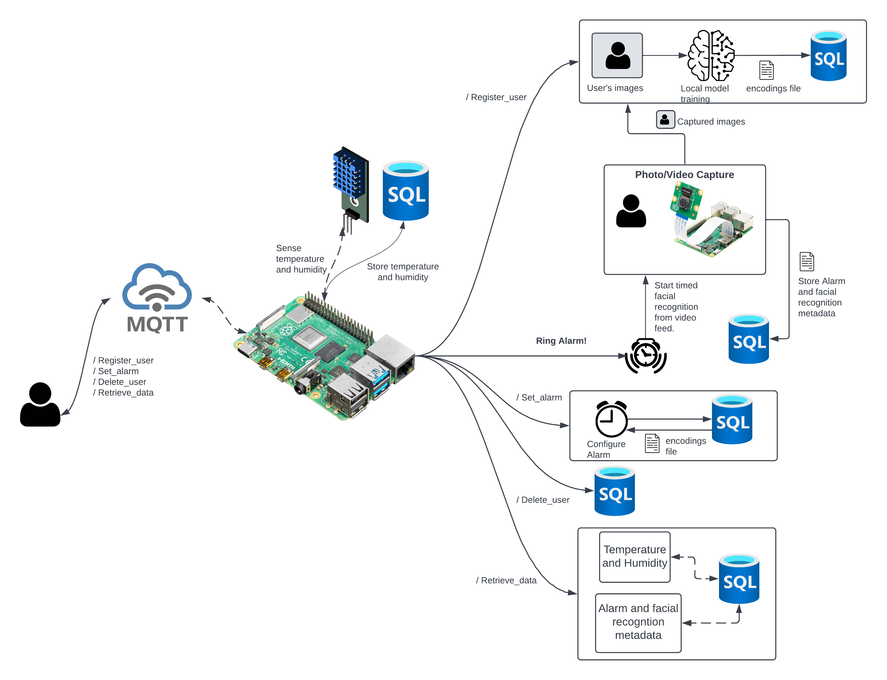
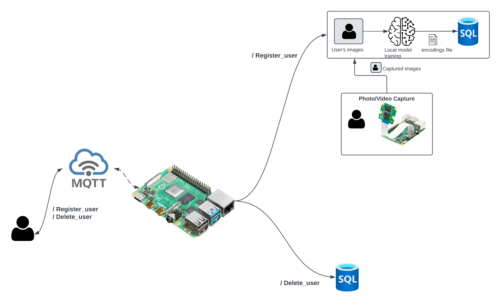
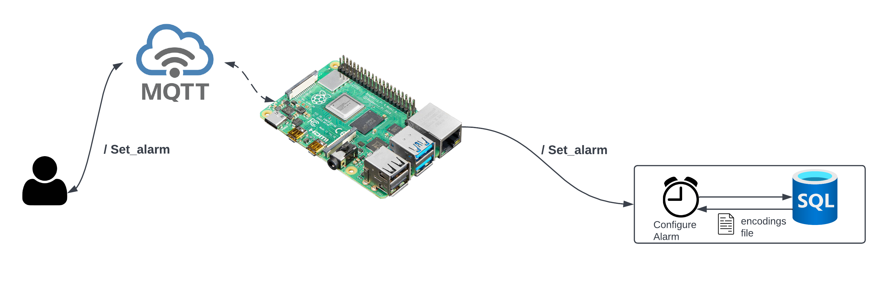
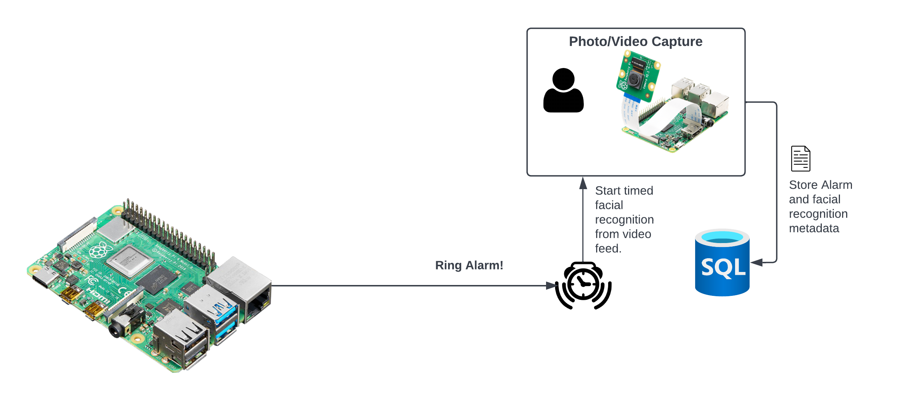
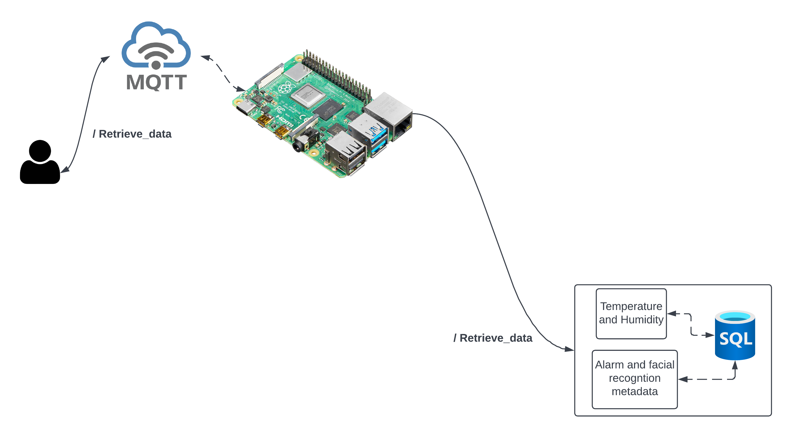

# Smart IoT Alarm Clock


## Overview
A smart alarm clock supporting configurable timed facial recognition, ambient climate sensing and data querying.

## Architecture
The architecture of Sparky uses multithreading for concurrent execution of MQTT requests, 
alarm time checking and ambient climate data upload.



## Register/Delete User
Sparky captures multiple facial images and trains a local OpenCV model with those images.
The resultant encodings file is stored in the database.



Deleting a user is a simple database call. See [register_user](#registerdelete-user-1) 
and [delete_user](#registerdelete-user-1) for its request schema.

## Set Alarm
Setting an alarm entails: 
- Verifying the user.
- Retrieving their facial encodings from the database. 
- Persisting the returned file locally.
- Updating local state to configure the alarm time.



See [set alarm](#set-alarm-1) for its request schema.

## Ring Alarm



## Query Data



## Specifications
- Facial Recognition: **OpenCV**
- Database: **Azure MySQL**
- Message Queue: **EMQ MQTT**

## Requirements
### Hardware
- Raspberry Pi (guaranteed to work on a 4)
- Audio output compatible with a Pi.
- Camera compatible with a Pi.
- DHT 11 temperature sensor
  

### Software
- Access to [MQTT X Web](https://mqttx.app/web)

### Configuration files
By design, connecting to a MySQL database or MQTT broker requires a configured `.env` file. EMQ provides a free broker. 
See [here](https://www.emqx.com/en/blog/use-mqtt-with-raspberry-pi#:~:text=install%20paho%2Dmqtt-,The%20use%20of%20MQTT,-Connect%20to%20the) for more details.

## Run
- Install all external dependencies on the import listing.
- Execute the `main.py` file
- Verify database connection was successful through stdout output: `Connection established Successfully!`
- Go to MQTT X Web and set up a connection to your broker or the free broker.
- Subscribe to `output_topic` defined in `main.py`
- Input [requests](#requests-schema) to a topic in `input_topics` defined in `main.py`

## Requests Schema

### Register/Delete User
```
    username   
```

- `username` is an alphanumeric string.

### Set Alarm
```
    username, alarmTime, facialRecognitionDuration    
```

- `username` is a [registered](#register-user) username.
- `alarmTime` is a 12-hour format string following `HH:MM (A|P)M`
- `facialRecognitionDuration` is the number of seconds the system will maintain continuous facial recognition.
The system restarts the timer whenever the recognition fails. 
Note this value must be lesser than `max_facial_recognition_duration` which the system uses for timing out the recognition.

### Retrieve Data

#### Temperature & Humidity
```
    t&h, param   
```

- `param` can be either a positive integer specifying number of days before current date or a specific date formatted as `mm/dd/yyyy`

#### Alarm data
```
    username, (columns), param   
```

* `username` is a registered username
* `param` as defined [here](#temperature--humidity)
* `columns` is a subset of `[wake_up_duration, completed_face_recognition]` delimited by a semicolon. If empty, the request becomes `username, param`

* Example queries: 
    ```
    username, (wake_up_duration; completed_face_recognition), param   
    ```
  
    ```
    username, (wake_up_duration), param   
    ```

    ```
    username, (completed_face_recognition), param   
    ```

